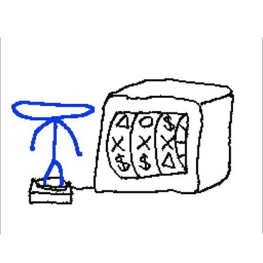

# Sistema de Gerenciamento de Contatos

Este é um projeto acadêmico desenvolvido em **Java** com o objetivo de demonstrar, na prática, o progresso e a aplicação dos conceitos lecionados na disciplina de **Programação Orientada a Objetos (POO)**.

A aplicação foi construída de maneira incremental: cada nova versão serve como base para introduzir estruturas de dados mais complexas, boas práticas de arquitetura e novas funcionalidades.

## Escopo do Projeto

O foco principal é o desenvolvimento de uma **Agenda de Contatos**. A jornada do código inicia em uma estrutura puramente sequencial e procedural, evoluindo passo a passo até se transformar em um software robusto com conceitos de POO, interface gráfica e armazenamento persistente.

## Cronograma de Versões e Recursos

| Versão | Mecanismo de Armazenamento | Resumo da Implementação |
|---|---|---|
| **v0.0.0** | Variáveis primitivas | Retém apenas um único registro ativo em memória |
| **v0.1.0** | Vetores (Arrays) | Capacidade para múltiplos registros com limite estático |
| **v0.2.0** | List + ArrayList | Gerenciamento de múltiplos contatos com tamanho flexível |
| **v0.3.0** | List + ArrayList | Inclusão do recurso de edição para registros salvos |
| **v1.0.0** | List + ArrayList | Divisão do código em blocos lógicos (métodos) na classe principal |
| **v1.1.0** | List + ArrayList | Desacoplamento de código em novas classes e arquivos de suporte |
| **v1.1.1** | List + ArrayList | Resolução de falha crítica na rotina de fechamento do sistema |
| **v2.1.0** | Arquivo TXT (Java I/O) | Armazenamento permanente em disco usando formato texto |

---

### v0.0.0 — Paradigma Procedural Inicial

A fundação inicial do sistema.

**Destaques desta versão:**
- Estrutura concentrada unicamente na classe `Principal`;
- Execução linear concentrada inteiramente dentro do método `main()`;
- Limitação de salvamento para apenas um contato por vez;
- Escopo baseado nas variáveis isoladas: `nome`, `celular` e `email`;
- Interface interativa via terminal (`Scanner`, rotinas `if-else`, `switch-case` e laço `while`);
- Operações disponíveis: Cadastro, Listagem, Busca, Remoção e Encerramento.

---

### v0.1.0 — Estruturas de Vetores e Limites Fixos

A primeira evolução focada em múltiplos dados.

**Destaques desta versão:**
- Substituição de variáveis isoladas por arrays tradicionais (`String[]`) para cada propriedade;
- Definição e controle rígido de um teto máximo de registros suportados;
- Varredura e manipulação baseada em índices numéricos e laços `for`;
- Lógica de busca linear e reorganização das posições do vetor após exclusões.

---

### v0.2.0 — Coleções Dinâmicas com ArrayList

Transição para estruturas de memória flexíveis nativas do ecossistema Java.

**Destaques desta versão:**
- Adoção do framework de coleções do Java por meio de `List` e `ArrayList`;
- Implementação de tipagem segura utilizando Generics (`<String>`);
- Alocação de memória sob demanda, eliminando limites rígidos de tamanho;
- Emprego prático dos métodos nativos da linguagem: `add`, `get`, `remove`, `size` e `indexOf`;
- Simplificação da leitura de dados através do laço `for-each`.

---

### v0.3.0 — Atualização Dinâmica de Dados

Implementação do ciclo completo de modificação de registros.

**Destaques desta versão:**
- Acréscimo de uma nova funcionalidade ao menu interativo: **Alterar contato**;
- Fluxo que localiza previamente o índice do registro alvo antes da modificação;
- Atualização em tempo real das listas utilizando o método nativo `set()`.

---

### v1.0.0 — Modularização e Funções Específicas

Primeiro grande passo de refatoração para organizar o fluxo de código procedural.

**Mudanças estruturais:**
- Distribuição das regras de negócio nos métodos dedicados: `adicionar()`, `listar()`, `pesquisar()`, `atualizar()` e `excluir()`;
- Limpeza drástica no método principal (`main`), tornando o bloco do `switch-case` mais limpo;
- Fluxo de dados controlado por meio de parâmetros de entrada e argumentos de funções;
- Fixação de conceitos teóricos como escopo de variáveis, comportamentos sem retorno (`void`) e técnicas de refatoração de código.

---

### v1.1.0 — Separação de Arquivos e Responsabilidades

Abordagem focada em design de software e desacoplamento.

**Mudanças estruturais:**
- Criação de novas classes utilitárias e de controle de dados (`Uteis` e `Agenda`);
- Divisão explícita entre a camada de apresentação ao usuário (regras do console) e a camada com a lógica de manipulação de contatos.

---

### v1.1.1 — Ajuste Técnico de Fluxo (Hotfix)

Uma subversão voltada à estabilidade da ramificação v1.x.

**Mudanças estruturais:**
- Correção de um comportamento inesperado no encerramento do programa (opção de Saída);
- Implementação de boas práticas para garantir o encerramento correto do fluxo de leitura do objeto `Scanner`.

---

### v2.1.0 — Persistência em Arquivo Físico (TXT)

Migração do armazenamento volátil em memória para **gravação permanente**. Os contatos agora resistem ao fechamento do programa e permanecem gravados em um arquivo local `.txt`.

**Destaques e conceitos explorados:**
- Operações de leitura e escrita em disco orientadas pela biblioteca `java.io`;
- Manipulação e mapeamento físico do arquivo de dados com a classe `File`;
- Leitura otimizada por buffer linha a linha utilizando `FileReader` e `BufferedReader`;
- Escrita e formatação estruturada de dados através de `FileWriter` e `PrintWriter`;
- Inicialização inteligente com carregamento automático dos contatos salvos no arquivo;
- Rotinas que mantêm o arquivo TXT perfeitamente sincronizado a cada inserção, edição ou exclusão;
- Gestão de erros com o tratamento adequado de exceções do tipo `IOException`.

---

## Estado Atual da Aplicação

O projeto encontra-se na versão **v2.1.0** — Implementação de persistência de dados em arquivos TXT via pacotes `java.io`.

---

## Histórico de Tags

O controle de histórico e marcos do repositório adota a seguinte convenção de tags no Git:

```text
- v0 (Fase Inicial / Estruturas Básicas)
  - v0.0.0
  - v0.1.0
  - v0.2.0
  - v0.3.0
- v1 (Refatoração e Modularização)
  - v1.0.0
  - v1.1.0
  - v1.1.1
- v2 (Persistência de Dados)
  - v2.1.0
```

#### let's go gambling!




-> "Oh dang it!"
